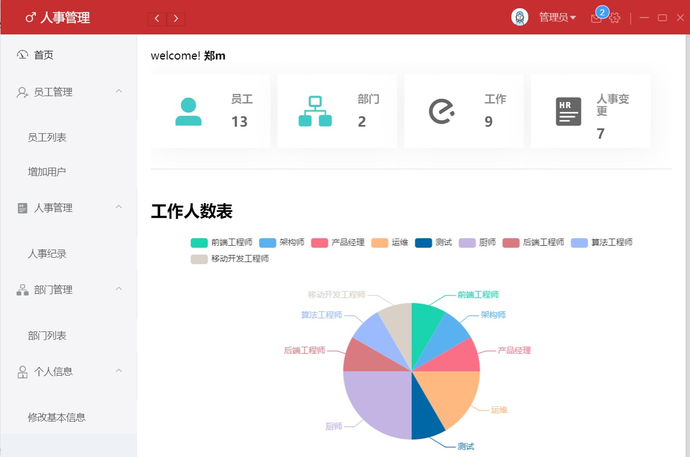
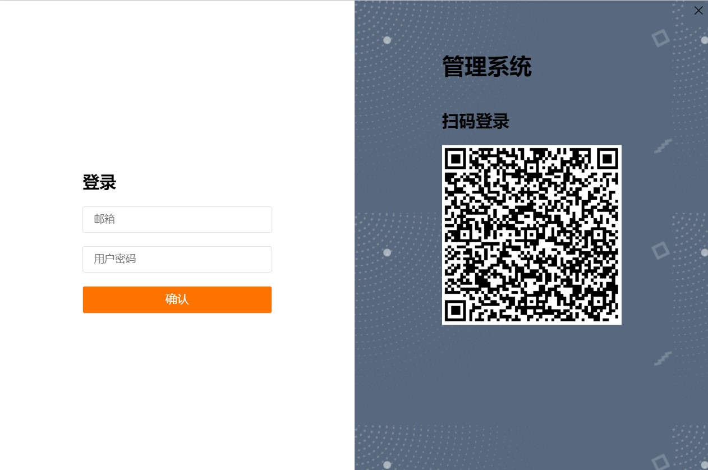

# 人事管理系统(electron)






这个小项目是我在数据库课程设计时完成的，功能比不是很完善，bug也比较多。支持邮箱密码登录，也支持微信扫码登录。微信扫码登录那里使用 `websocket` 完成后端到前端的消息传递。

**前端**

* html/css/js
* vue/vuecli/vuex/router
* electron
* v-charts

**后端**

* java
* springboot
* mybatis/mybatis-plus
* mysql


本项目分为前端和后端部分， 所以你需要分别安装其依赖。

前端依赖需要使用 npm 来安装， 后端需要maven。
后端部分： [springboot-employeemanger](https://github.com/zFitness/springboot-employeemanager)

> 本项目里面back 目录是存放 README.md里面的图片的，可以删除。

## 开始此项目
* clone 此项目
```
git clone https://gitee.com/zFitness/electron-employee-manager.git
cd electron-employee-manager
```
* 安装npm依赖

```
npm install
```

* 启动运行

```
npm run electron:serve
```

* 打包编译

```
npm run electron:build
```
